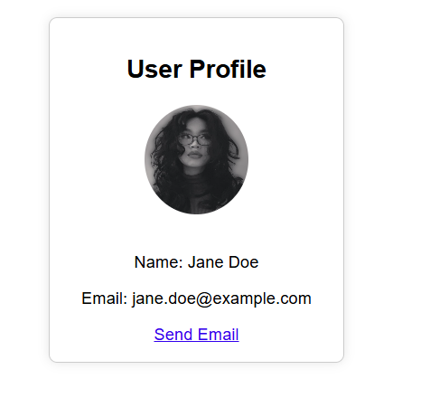

# 🧩 User Profile React Component

## 📋 Overview

This project demonstrates how to **convert a standard HTML snippet into JSX** for use in a React functional component. The focus is on learning key JSX syntax rules and React best practices for dynamic, reusable components.

---

## 🔄 Original HTML Snippet

```html
<div class="profile-card">
  <h2>User Profile</h2>
  
  <p>Name: Jane Doe</p>
  <p>Email: jane.doe@example.com</p>
  <a href="mailto:jane.doe@example.com">Send Email</a>
</div>
```

---

## ✅ JSX Conversion Changes

The HTML was converted into valid JSX inside a React component called `UserProfile`. The following changes were made:

- ✅ **Replaced `class` with `className`** (JSX requirement).
- ✅ **Wrapped all elements in a single parent `<div>`**.
- ✅ **Closed all self-closing tags properly** (like ``).
- ✅ **Replaced static content with dynamic `props`** for name, email, and image URL.
- ✅ **Used `mailto:` link dynamically with template literals**.
- ✅ **Image loaded dynamically via local import using props**.

---

## 🧠 Example JSX After Conversion

```jsx
function UserProfile(props) {
  const { name, email, photoUrl } = props;

  return (
    <div className="profile-card">
      <h2>User Profile</h2>
      
      <p>Name: {name}</p>
      <p>Email: {email}</p>
      <a href={`mailto:${email}`}>Send Email</a>
    </div>
  );
}
```

---

## 🚀 Getting Started

### Prerequisites

- Node.js and npm installed

### Setup Instructions

```bash
git clone https://github.com/your-username/user-profile-app.git
cd user-profile-app
npm install
npm start
```

This will start the development server at `http://localhost:3000`.

---

## 📁 Project Structure

```
/src
  ├── assets/
  │   └── Violet.jpeg
  ├── UserProfile.js
  ├── App.js
  └── App.css
```

---

## 📸 Screenshot



---

## 🧠 Learning Objectives

- Practice JSX syntax
- Use dynamic props in React
- Import and display local images in components
